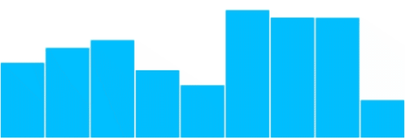
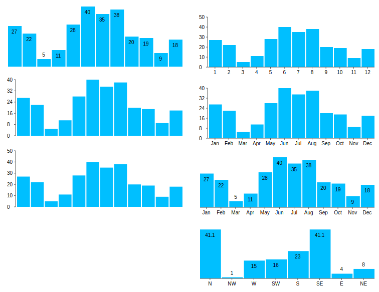
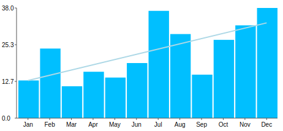

<p align="center">
  <h1>Pure Vue Chart</h1>
</p>
<p align="center">
    A simple and lightweight vue component for making charts that do not rely on large chart libraries and will not bloat your dependencies
</p>
<hr/>

<h3>Example</h3>

```
<pure-vue-chart
  :points="[3,5,2,5,4]"
  :width="400"
  :height="200"
/>
```



<p>When propes are updated the graph will automatically animate to the new values.</p>

## Install
```
npm i pure-vue-chart
```
Import it:
```
import PureVueChart from 'pure-vue-chart';
```
Register it in your component:
```
components: {
    PureVueChart,
},
```
## Use it
```
<pure-vue-chart
  :points="[3,5,2,5,4]"
  :width="400"
  :height="200"
/>
```
## Options
<p>To further control the display of data, you can use simple props to manipulate the charts. Here are some examples:</p>



#### Most of the available props below are self-explanatory:
```
:points=[1,4,5,3,4]
:show-y-axis="false"
:show-x-axis="true"
:width="400"
:height="200"
:show-values="true"
:use-month-labels="true"
:months="['Jan', 'Fev', 'Mar', 'Abr', 'Mai', 'Jun', 'Jul', 'Ago', 'Set', 'Out', 'Nov', 'Dez']"
```

### Additional Features:
#### Trendline
You can add a simple linear trend line by using the following props:
```
:show-trend-line="true"
:trend-line-width="2"
trend-line-color="lightblue"
```


#### X-axis labels:
X-axis labels, by default will be from 1 - length-of-data.
But you can automatically use Months by using the prop `:use-month-labels="true"`.
Or you can provide the data as an array of objects, each with a `value` and `label` like so:
```
:points=[{label: 'N', value: 41.1}, {label: 'NW', value: 1}, {label: 'W', value: 15}]
```

<h3>Contributing</h3>
I'm open to any issues or pull requests so long as
they are simple, easy to read, use the eslint settings in package.json, 
and follow commitizen-esque style commit formats. Just open an issue on github and start a discussion.
- pure-vue-chart issues - https://github.com/djaxho/pure-vue-chart/issues

<h3>Authors or Acknowledgments</h3>
<ul>
  <li>Danny Jackson</li>
</ul>

<h3> List of features </h3>
<ul>
  <li>Simple bar charts</li>
  <li>Line charts (planned)</li>
  <li>Pie charts (planned)</li>
  <li>Rose charts (planned)</li>
</ul>

<h3>License</h3>

This project is licensed under the MIT License but please create pull requests to improve this package together rather that copying itto another project.
